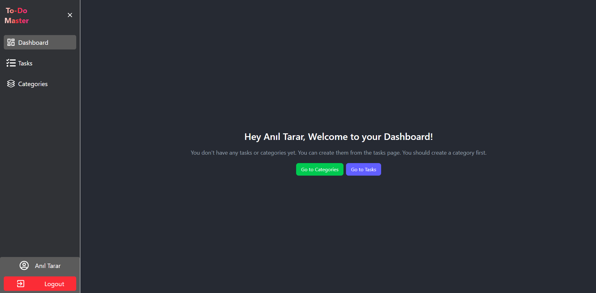
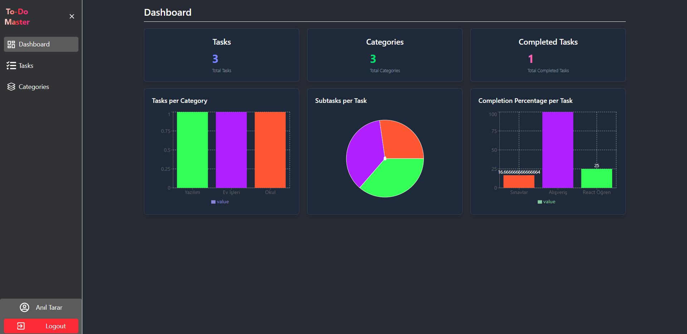
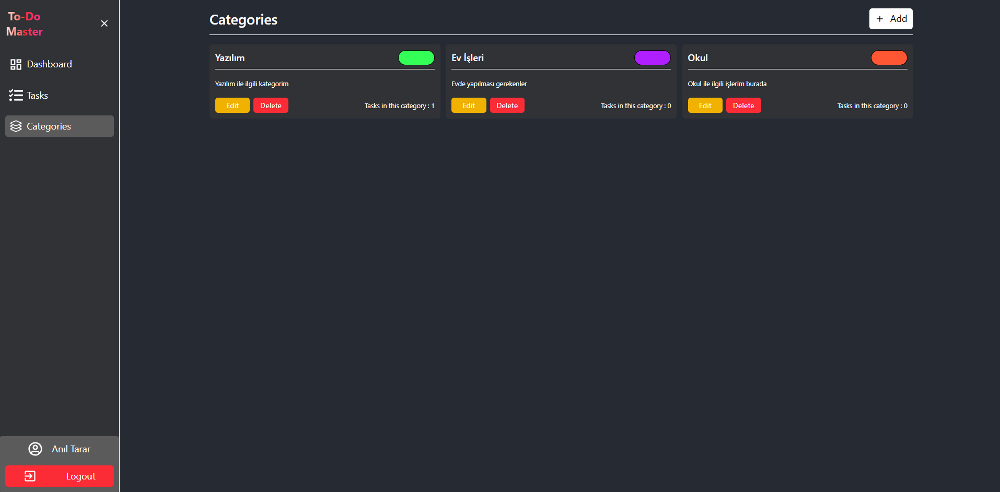
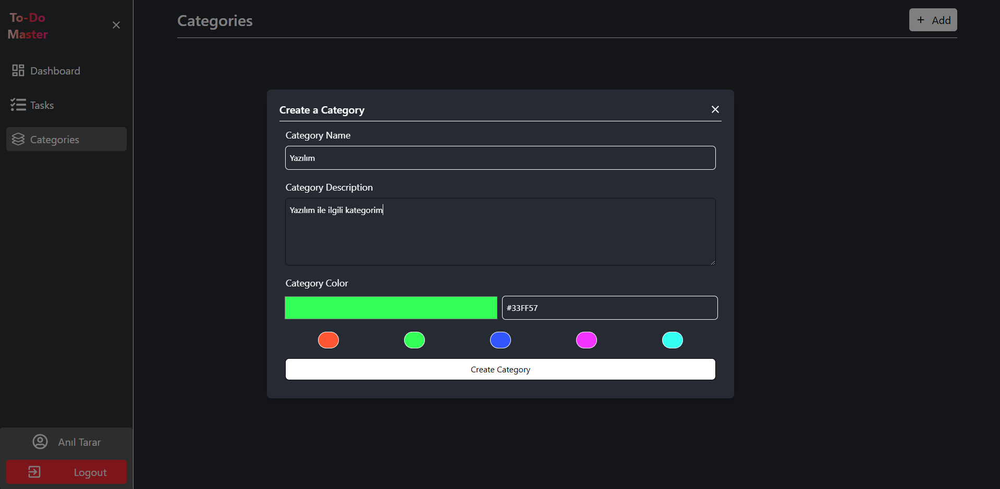
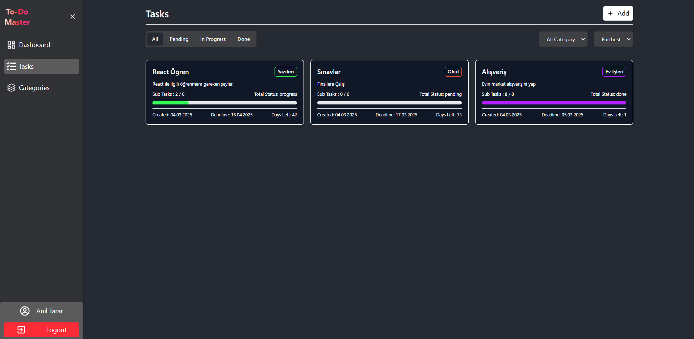
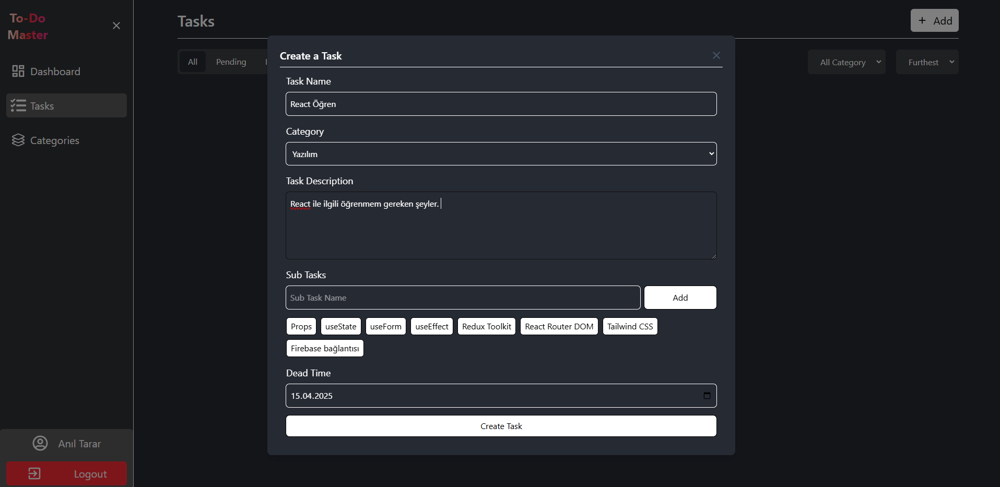
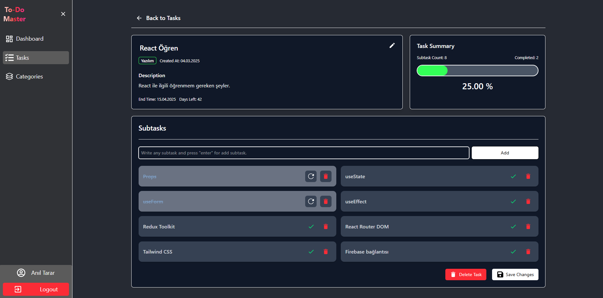
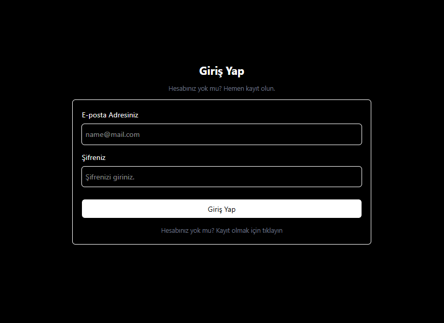
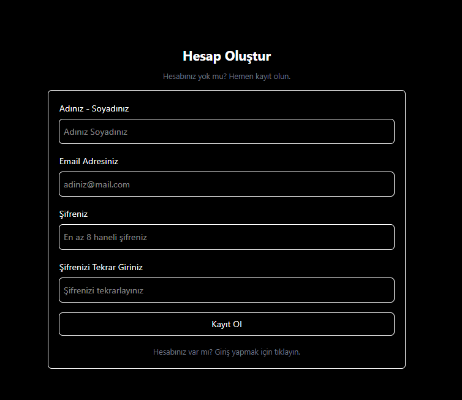

# 📌 To-Do Master

Bu proje, kullanıcıların görevlerini ve kategorilerini yönetebileceği interaktif bir **To-Do Master** uygulamasıdır.

---

## 🚀 Özellikler

✅ Görev ve kategori oluşturma, düzenleme, silme  
✅ Tamamlanma durumu takibi  
✅ Kategorilere özel renk atama  
✅ Ana ekranda genel durum istatistikleri  
✅ Grafiklerle görselleştirilmiş görev ve kategori analizi  
✅ Duyarlı (responsive) tasarım  

---

## 📸 Ekran Görüntüleri

Ana ekran görünümü:



Genel Dashboard:



Kategori Yönetimi:



Kategori Oluşturma:



Görev Yönetimi:



Görev Oluşturma:



Görev Detayı:



Giriş Ekranı:



Kayıt Ekranı:



---

## 📦 Kurulum

### 1️⃣ **Depoyu Klonlayın**
```sh
 git clone https://github.com/aniltarar/To-Do-Master
 cd to-do-dashboard
```

### 2️⃣ **Bağımlılıkları Yükleyin**
```sh
 npm install
```

### 3️⃣ **Çevre Değişkenlerini (.env) Ayarlayın**
`.env` dosyanızın içeriği şu şekilde olmalıdır:
```
VITE_API_URL=your-api-url
VITE_FIREBASE_API_KEY=your-firebase-api-key
```

### 4️⃣ **Geliştirme Ortamında Çalıştırın**
```sh
 npm run dev
```


---

## 🛠 Kullanılan Teknolojiler
- **React** (Vite)
- **Redux Toolkit** (Global State Yönetimi)
- **Tailwind CSS** (Stil)
- **Recharts** (Grafikler)
- **Firebase** (Gerçek zamanlı veritabanı ve kimlik doğrulama)

---


📧 **İletişim**: Eğer herhangi bir sorunuz varsa, bana [anil_tarar@hotmail.com](mailto:anil_tarar@hotmail.com) adresinden ulaşabilirsiniz!

